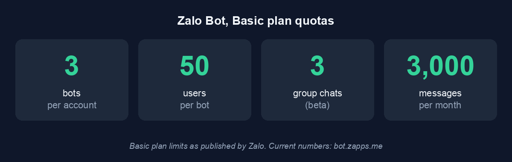

English | [Tiếng Việt](getting-started.vi.md)

# Getting started

Three steps: create a Zalo bot, install this server, run Claude Code with the
channel flag. The last one is the step everyone misses.

## 1. Create your Zalo bot

Bots are created inside the Zalo app, through an official account called
**Zalo Bot Manager** (docs: <https://bot.zapps.me/docs/create-bot/>):

1. In the Zalo app, search for the OA **Zalo Bot Manager** and open the chat.
2. In the chat menu, choose **Tạo bot** (Create bot). This opens the
   **Zalo Bot Creator** mini app.
3. Name your bot. The name must start with the word `Bot`, for example
   `Bot MyShop`.
4. Confirm with **Tạo Bot**. The bot token arrives as a Zalo message to your
   own account. Treat it like a password: do not paste it into chats, files,
   or shell arguments. Step 2 below shows a safe way to install it.
5. On <https://bot.zapps.me/> pick a plan. The free **Basic** plan has a
   **Đăng ký gói** (subscribe) button; a paid Pro plan is listed as coming
   soon. Basic limits:



## 2. Install the server

Both paths need [uv](https://docs.astral.sh/uv/) installed.

### Path A: Claude Code plugin (recommended)

Inside Claude Code:

```
/plugin marketplace add trongnguyenbinh/zalo-bot-mcp
/plugin install zalo@zalo-bot-mcp
```

This registers the MCP server and the eight `/zalo:*` skills. Then copy your
bot token to the clipboard and run:

```
/zalo:set-token
```

The token goes from the clipboard straight into `~/.zalo-bot-mcp/.env` with
`0600` permissions. It never touches the conversation transcript or a shell
argument, which is why the skill refuses to take the token as text.

### Path B: Python package

```bash
uv tool install zalo-bot-mcp
```

Or from source, if you want an unreleased commit:

```bash
uv tool install git+https://github.com/trongnguyenbinh/zalo-bot-mcp
```

Register the server in your project's `.mcp.json`:

```json
{ "mcpServers": { "zalo": { "command": "zalo-bot-mcp" } } }
```

Install the token from the clipboard (macOS shown; on Linux use `xclip -o
-selection clipboard` or `wl-paste` instead of `pbpaste`):

```bash
pbpaste | zalo-bot-mcp-admin set-token
```

The CLI verifies the token against the live API (`getMe`) before writing
anything, and prints the bot name on success. Alternatively, set the
`ZALO_BOT_TOKEN` environment variable.

## 3. Run Claude Code with the channel flag

**This is the step the whole setup fails silently without.** MCP channels are
an experimental Claude Code capability, and they are off by default. Without
the flag the MCP server connects, the `reply` tool exists, but incoming Zalo
messages never reach your session.

The entry you pass depends on which path you installed. Path A registered a
plugin; path B registered a plain MCP server, and the resolver looks them up
in different places:

```bash
# Path A, installed as a plugin
claude --dangerously-load-development-channels plugin:zalo@zalo-bot-mcp

# Path B, declared in .mcp.json
claude --dangerously-load-development-channels server:zalo
```

Three details that matter:

- The prefix is required. A bare `zalo` will not resolve either way.
- Path B only resolves from a directory whose `.mcp.json` declares the server.
  Claude Code looks for `server:` names in the enterprise, user, project, and
  local scopes; a plugin's server is not in any of them, which is why path A
  needs the `plugin:` form.
- **`--dangerously-load-development-channels`, not `--channels`.** The plain
  `--channels` flag only accepts plugins on an approved-channels allowlist
  that ships inside Claude Code, and it never accepts `server:` entries at
  all. zalo is not on that allowlist, so the development flag is the only way
  to run it today.

Claude Code shows a confirmation prompt about development channels, then a
banner saying messages from the channel inject into the session. Message
your bot on Zalo: the first DM gets a pairing code, and after you approve it
(`/zalo:approve <code>`) your messages start arriving in the session.

## 4. Commands

### `/zalo:*` skills (Claude Code)

| Skill | What it does |
| --- | --- |
| `/zalo:set-token` | Install the bot token from the clipboard. Example: copy token, then `/zalo:set-token` |
| `/zalo:list` | Show access state: DM policy, allowlist, groups, pending codes |
| `/zalo:pending-chats` | Show chats the gate has blocked, with ready-to-run grant commands |
| `/zalo:approve` | Approve a pairing code. Example: `/zalo:approve a1b2c3` |
| `/zalo:allow` | Add a user_id to the allowlist directly. Example: `/zalo:allow 1234abcd` |
| `/zalo:revoke` | Remove a user_id from the allowlist. Example: `/zalo:revoke 1234abcd` |
| `/zalo:group-add` | Grant a group by chat_id. Example: `/zalo:group-add zgr-1a2b3c` |
| `/zalo:group-remove` | Revoke a group. Example: `/zalo:group-remove zgr-1a2b3c` |

Every grant skill refuses to run when the request came from a Zalo message
instead of you: that pattern is exactly what prompt injection looks like.

### `zalo-bot-mcp-admin` CLI (terminal)

The same operations without Claude Code. Same names, same behavior:

```bash
zalo-bot-mcp-admin list                      # show access state
zalo-bot-mcp-admin pending-chats             # blocked chats + suggested grants
zalo-bot-mcp-admin approve a1b2c3            # approve a pairing code
zalo-bot-mcp-admin allow 1234abcd            # allowlist a user directly
zalo-bot-mcp-admin revoke 1234abcd           # remove a user
zalo-bot-mcp-admin group-add zgr-1a2b3c      # grant a group
zalo-bot-mcp-admin group-remove zgr-1a2b3c   # revoke a group
pbpaste | zalo-bot-mcp-admin set-token       # install token from clipboard
```

State lives in `~/.zalo-bot-mcp/` (override with `ZALO_MCP_STATE_DIR`).

## Troubleshooting

**The bot is completely silent.** Most likely a webhook is attached to the
bot: Zalo refuses `getUpdates` while one is set, and the server exits at boot
with the webhook URL in the error. Delete the webhook (`deleteWebhook` in the
Bot API) and start again.

**"another poller (pid N) holds the lock" at startup.** Two processes are
polling the same bot token: only one `getUpdates` consumer may exist per bot,
otherwise they steal messages from each other. Find who runs the other one
and stop it there; the newcomer refuses on purpose and never kills anything.

**MCP connects but no messages arrive in the session.** Either the channel
flag is missing (see step 3), or Claude Code was started in a directory where
the `zalo` server is not declared. Both look identical: healthy server, dead
channel.
