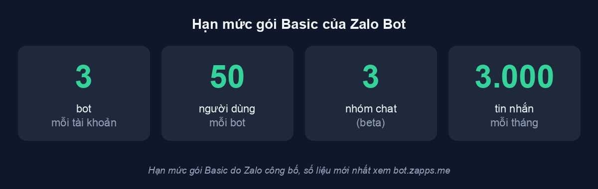

[English](getting-started.md) | Tiếng Việt

# Bắt đầu

Ba bước: tạo bot Zalo, cài server này, chạy Claude Code kèm flag channel. Bước
cuối mới là bước ai cũng quên.

## 1. Tạo bot Zalo

Bot được tạo ngay trong ứng dụng Zalo, qua tài khoản chính thức tên
**Zalo Bot Manager** (tài liệu: <https://bot.zapps.me/docs/create-bot/>):

1. Trong ứng dụng Zalo, tìm OA **Zalo Bot Manager** và mở khung chat.
2. Trong menu của khung chat, chọn **Tạo bot**. Mini app **Zalo Bot Creator**
   sẽ mở ra.
3. Đặt tên cho bot. Tên bắt buộc bắt đầu bằng chữ `Bot`, ví dụ `Bot MyShop`.
4. Bấm **Tạo Bot** để xác nhận. Token của bot được gửi về tài khoản Zalo của
   bạn dưới dạng tin nhắn. Hãy coi nó như mật khẩu: đừng dán vào chat, vào
   file, hay vào tham số dòng lệnh. Bước 2 bên dưới có cách nạp token an toàn.
5. Trên <https://bot.zapps.me/> chọn gói. Gói miễn phí **Basic** có nút
   **Đăng ký gói**; gói Pro trả phí đang ghi là sắp ra mắt. Hạn mức gói Basic:



## 2. Cài server

Cả hai đường đều cần cài sẵn [uv](https://docs.astral.sh/uv/).

### Đường A: plugin Claude Code (khuyên dùng)

Trong Claude Code:

```
/plugin marketplace add trongnguyenbinh/zalo-bot-mcp
/plugin install zalo@zalo-bot-mcp
```

Lệnh này đăng ký MCP server và tám skill `/zalo:*`. Sau đó copy token của bot
vào clipboard rồi chạy:

```
/zalo:set-token
```

Token đi thẳng từ clipboard vào `~/.zalo-bot-mcp/.env`, quyền `0600`. Nó không
nằm lại trong nội dung hội thoại, cũng không nằm trong tham số dòng lệnh. Đó
là lý do skill này không nhận token gõ tay.

### Đường B: gói Python

```bash
uv tool install zalo-bot-mcp
```

Hoặc cài từ source, nếu muốn lấy commit chưa release:

```bash
uv tool install git+https://github.com/trongnguyenbinh/zalo-bot-mcp
```

Khai báo server trong `.mcp.json` của thư mục dự án:

```json
{ "mcpServers": { "zalo": { "command": "zalo-bot-mcp" } } }
```

Nạp token từ clipboard (lệnh macOS; trên Linux thay `pbpaste` bằng
`xclip -o -selection clipboard` hoặc `wl-paste`):

```bash
pbpaste | zalo-bot-mcp-admin set-token
```

CLI gọi `getMe` hỏi API thật xem token có đúng không rồi mới ghi, đúng thì in
tên bot ra. Cách khác: đặt biến môi trường `ZALO_BOT_TOKEN`.

## 3. Chạy Claude Code với flag channel

**Thiếu bước này thì mọi thứ chết im lặng.** MCP channel là tính năng thử
nghiệm của Claude Code, mặc định tắt. Không có flag thì MCP server vẫn kết
nối được, tool `reply` vẫn có, nhưng tin nhắn Zalo không bao giờ vào session.

Gõ entry nào là tuỳ bạn cài theo đường nào. Đường A đăng ký một plugin, đường
B đăng ký một MCP server thường, và Claude Code tra hai thứ đó ở hai chỗ khác
nhau:

```bash
# Đường A, cài dạng plugin
claude --dangerously-load-development-channels plugin:zalo@zalo-bot-mcp

# Đường B, khai trong .mcp.json
claude --dangerously-load-development-channels server:zalo
```

Ba chi tiết quan trọng:

- Bắt buộc có prefix. Gõ trống trơn `zalo` là không nhận, đường nào cũng vậy.
- Đường B chỉ chạy khi bạn đứng trong thư mục có `.mcp.json` khai server đó.
  Claude Code tìm tên `server:` trong scope enterprise, user, project, local,
  mà server của một plugin không nằm trong scope nào trong bốn cái đó, nên
  đường A phải dùng dạng `plugin:`.
- **Là `--dangerously-load-development-channels`, không phải `--channels`.**
  Flag `--channels` chỉ nhận plugin nằm trong allowlist mà Claude Code nhúng
  sẵn, và không nhận entry `server:` trong mọi trường hợp. zalo không có trong
  allowlist đó, nên hiện tại flag development là đường duy nhất.

Claude Code sẽ hỏi xác nhận về development channels, rồi hiện banner báo tin
nhắn từ channel sẽ vào thẳng session. Nhắn thử cho bot trên Zalo: tin DM
đầu tiên nhận được mã pairing, bạn duyệt mã (`/zalo:approve <mã>`) xong thì
tin bắt đầu vào session.

## 4. Danh sách lệnh

### Skill `/zalo:*` (trong Claude Code)

| Skill | Công dụng |
| --- | --- |
| `/zalo:set-token` | Nạp token bot từ clipboard. Ví dụ: copy token xong gõ `/zalo:set-token` |
| `/zalo:list` | Xem trạng thái access: policy DM, allowlist, nhóm, mã đang chờ |
| `/zalo:pending-chats` | Xem các chat bị gate chặn, kèm sẵn lệnh cấp quyền |
| `/zalo:approve` | Duyệt mã pairing. Ví dụ: `/zalo:approve a1b2c3` |
| `/zalo:allow` | Thêm thẳng một user_id vào allowlist. Ví dụ: `/zalo:allow 1234abcd` |
| `/zalo:revoke` | Gỡ một user_id khỏi allowlist. Ví dụ: `/zalo:revoke 1234abcd` |
| `/zalo:group-add` | Cấp quyền một nhóm theo chat_id. Ví dụ: `/zalo:group-add zgr-1a2b3c` |
| `/zalo:group-remove` | Gỡ quyền một nhóm. Ví dụ: `/zalo:group-remove zgr-1a2b3c` |

Mọi skill cấp quyền đều từ chối chạy khi yêu cầu đến từ một tin nhắn Zalo
thay vì từ chính bạn. Đó đúng là cách một cú chèn lệnh sẽ diễn ra.

### CLI `zalo-bot-mcp-admin` (ngoài terminal)

Đúng các thao tác trên, không cần Claude Code:

```bash
zalo-bot-mcp-admin list                      # xem trạng thái access
zalo-bot-mcp-admin pending-chats             # chat bị chặn + lệnh gợi ý
zalo-bot-mcp-admin approve a1b2c3            # duyệt mã pairing
zalo-bot-mcp-admin allow 1234abcd            # thêm thẳng user vào allowlist
zalo-bot-mcp-admin revoke 1234abcd           # gỡ user
zalo-bot-mcp-admin group-add zgr-1a2b3c      # cấp quyền nhóm
zalo-bot-mcp-admin group-remove zgr-1a2b3c   # gỡ quyền nhóm
pbpaste | zalo-bot-mcp-admin set-token       # nạp token từ clipboard
```

State nằm ở `~/.zalo-bot-mcp/` (đổi bằng biến `ZALO_MCP_STATE_DIR`).

## Xử lý sự cố

**Bot im hoàn toàn.** Khả năng cao bot đang gắn webhook: Zalo từ chối
`getUpdates` khi webhook còn đó, và server thoát ngay lúc khởi động kèm URL
webhook trong thông báo lỗi. Xoá webhook (`deleteWebhook` trong Bot API) rồi
chạy lại.

**Khởi động báo "another poller (pid N) holds the lock".** Hai tiến trình
đang cùng poll một token: mỗi bot chỉ được đúng một tiến trình gọi `getUpdates`,
nếu không hai bên giật tin của nhau. Tìm xem tiến trình kia chạy ở đâu và tắt
ở đó; tiến trình mới cố tình từ chối chứ không bao giờ tự giết ai.

**MCP kết nối được mà tin không vào session.** Hoặc thiếu flag channel (xem bước 3),
hoặc Claude Code được mở ở thư mục không khai server `zalo`. Hai lỗi nhìn
giống hệt nhau: server khỏe, channel chết.
